# Vital OS

Vital OS 0.1.0 is a personal desktop image based on Ubuntu 24.04 LTS (noble). The interface is GNOME, the palette is graphite and champagne, and the artwork is original. It is not a Canonical product, not an NVIDIA product, and it does not reuse those companies' logos, wallpapers, or themes.

The codename for this look is **Nocturne**. Color, type, and the mark are documented in [branding/README.md](branding/README.md).

## What you get

- A hybrid live and install ISO for BIOS and UEFI. Secure Boot is not part of 0.1.0; turn it off to boot.
- Calamares as the installer. Ubuntu's desktop installer (`ubuntu-desktop-bootstrap`) is a snap tied to Ubuntu's own session and branding, and the server-side Subiquity UI is not a desktop installer. Calamares is the practical choice for a small derivative: it is packaged in Ubuntu 24.04 universe, it runs offline, and its branding files are plain text.
- GNOME Shell with dark mode by default, Papirus Dark icons (folders tinted pale brown), an original shell stylesheet, a bottom dock (Dash to Dock), Desktop Icons, and dconf defaults.
- GDM login branding, a Plymouth boot splash, and a GRUB theme.
- `/etc/os-release` and `/etc/lsb-release` identify the system as Vital OS 0.1.0. `ID_LIKE` stays `ubuntu debian` so Ubuntu-oriented packages still match. `VERSION_CODENAME` stays `noble` for the same reason. Settings → About reads `PRETTY_NAME`.
- Vital Welcome, a GTK4 / libadwaita first-run app (welcome, appearance, curated apps, privacy and updates). It autostarts once per user, then writes `~/.config/vitalos/welcome-completed`. The title is Vital OS and its version. “based on Ubuntu 24.04 LTS” is a secondary line.
- Vital Marketplace, a GTK4 catalog browser in the app grid and on the Welcome apps page. It installs through a polkit helper, checks SHA-256 before running a downloaded package or script, and falls back to a bundled catalog. The publishing service is documented in [marketplace/README.md](marketplace/README.md).
- Firefox from Mozilla's apt archive (not the Ubuntu transitional snap), Files, Console, Text Editor, Loupe, Evince, Celluloid, LibreOffice Writer and Calc, GNOME Software, and Flatpak with Flathub configured.
- The package set is [config/packages.desktop.list](config/packages.desktop.list). Live-only packages are [config/packages.live.list](config/packages.live.list) and Calamares removes them on install.

Ubuntu's `gnome-shell` package depends on the name `ubuntu-wallpapers`. The build installs an empty package of that name so Canonical's wallpaper files are not unpacked. `whoopsie` can still be pulled in by Settings; its service is masked and crash reports stay off.

Vital OS can send an anonymous install count to `https://vital-os.org/api/v1/telemetry`: a random id, the OS version, and either `install` or a weekly `heartbeat`. It does not send a name, username, email, hostname, or hardware id. The switch is in Vital Welcome and is on until you turn it off. Details are in [PRIVACY.md](PRIVACY.md). The catalog host is `vital-os.org`; the API prefix is `/api/v1`, and the admin UI is `https://vital-os.org/mgmt`. See [marketplace/README.md](marketplace/README.md).

## Build an ISO locally

Host packages (Ubuntu or Debian):

```bash
sudo ./build.sh install-deps
```

That installs debootstrap, squashfs-tools, xorriso, GRUB image tools, mtools, fonts, and the SVG renderer. You need root, a network path to `archive.ubuntu.com` and `packages.mozilla.org`, and about 18 GB free. The script adds an 8 GB swap file when available RAM is under 4 GB.

```bash
sudo ./build.sh iso
# or
sudo make iso
```

The image is written to `build/output/VitalOS-0.1.0-amd64.iso`. Build trees live under `build/work/` and are gitignored. Nothing in this repository is a built ISO.

Useful environment variables:

| Variable | Meaning |
| --- | --- |
| `VITAL_MIRROR` | Mirror URL passed to debootstrap. Default: `http://archive.ubuntu.com/ubuntu` |
| `VITAL_SQUASHFS_COMP` | `xz` (default) or `gzip` |
| `VITAL_KEEP_ROOTFS=1` | Keep the debootstrap tree after the ISO is packed |

Static checks do not need root:

```bash
./build.sh check
make screenshots
```

`make screenshots` rasterizes the SVGs into `docs/screenshots/`. Those pictures are composed previews of the branding assets (wallpaper, Plymouth frame, GDM card, desktop chrome). They are not screenshots of a booted VM unless a later note in this file says they are.

### How the image is assembled

1. `debootstrap --variant=minbase noble` creates a minimal Ubuntu rootfs.
2. The desktop and live package lists are installed inside that rootfs, with apt pins that block `ubuntu-session`, Yaru, snapd, and Ubuntu's transitional Firefox package.
3. Firefox is installed from `packages.mozilla.org`. Dash to Dock 100 is unpacked from a checksum-pinned upstream zip. Papirus folders are tinted with papirus-folders 1.14.0.
4. `mksquashfs` writes `casper/filesystem.squashfs`. The kernel and initramfs are copied to `casper/`.
5. GRUB is embedded for El Torito BIOS and for a FAT EFI image. `xorriso` produces a hybrid ISO.

This is the same shape as a live-build / livecd-rootfs image (debootstrap, squashfs, casper, GRUB, xorriso) without Ubuntu's livecd-rootfs hook tree, which assumes Ubuntu branding and a package pool on the disc.

## Continuous integration

[.github/workflows/build-iso.yml](.github/workflows/build-iso.yml) does two jobs:

- On every pull request, and before a release build: `./build.sh check`.
- On `workflow_dispatch` and on tag pushes matching `v*`: build the ISO on `ubuntu-24.04`.

The ISO is split with `split -b 1900M` when it is larger than 1900 MiB, so each GitHub release asset stays under the 2 GiB limit. `SHA256SUMS` and `README-download.txt` sit next to the parts. Reassemble with:

```bash
cat VitalOS-0.1.0-amd64.iso.part* > VitalOS-0.1.0-amd64.iso
sha256sum -c SHA256SUMS
```

Workflow artifacts are kept for 2 days. A tag push creates a release named after the tag. A manual run creates a prerelease tagged `ci-<run id>` unless the workflow input `publish_release` is turned off. The artifact is uploaded either way.

## Try it in a virtual machine

Write the ISO to a USB drive with your usual tool, or attach it as a virtual CD.

**QEMU** (after `sudo apt install qemu-system-x86 ovmf`):

```bash
tools/qemu-boot.sh bios
tools/qemu-boot.sh uefi
```

Or by hand:

```bash
qemu-system-x86_64 -m 3072 -smp 2 -cdrom build/output/VitalOS-0.1.0-amd64.iso \
  -boot d -vga virtio -enable-kvm -cpu host
```

Give the guest at least 3 GB of RAM. The GRUB menu offers Try, Install, and safe graphics. Try logs in automatically as `vital` with no password and passwordless sudo. Install launches Calamares. The installed user sets their own password; the live sudo rule is not copied onto the target.

**VirtualBox:** new Linux / Ubuntu 64-bit VM, 3 GB RAM, EFI enabled if you want to test UEFI (System → Enable EFI). Attach the ISO to the optical drive. Disable Secure Boot in the EFI settings if the firmware offers it. Install Guest Additions only after the system is on disk; they are not part of the image.

**VMware ESXi:** upload the ISO to a datastore, create a custom VM with the Ubuntu 64-bit guest type, 2 vCPU, 3 GB RAM, and the ISO on the virtual CD. For UEFI, set the firmware to EFI and leave Secure Boot unchecked. Use a paravirtual SCSI controller and a VMXNET3 adapter if you want the smoother live session. Open the console, pick Try or Install in GRUB, and let the squashfs overlay settle before judging graphics performance.

## Layout

| Path | Role |
| --- | --- |
| `build.sh`, `Makefile` | Entrypoints |
| `build/in-chroot/configure-system.sh` | Package install and identity inside the rootfs |
| `config/packages.*.list` | Editable package sets |
| `config/calamares/` | Installer sequence and branding |
| `config/sources.env` | Pinned URLs and SHA256 sums for Firefox's key, Dash to Dock, and papirus-folders |
| `branding/` | Mark, palette, wallpapers, Plymouth, GRUB, shell CSS |
| `overlay/` | Files copied verbatim into the rootfs |
| `apps/vital-welcome/` | First-run app |
| `apps/vital-marketplace/` | Catalog browser and privileged helper |
| `marketplace/` | Catalog schema, sample catalog, API, CLI, and deploy files |
| `docs/screenshots/` | Rendered previews |
| `.github/workflows/build-iso.yml` | Check, build, release |

## Previews

These are rendered from the SVG sources in `branding/`. They show the intended wallpaper, boot frame, login card, and desktop chrome.


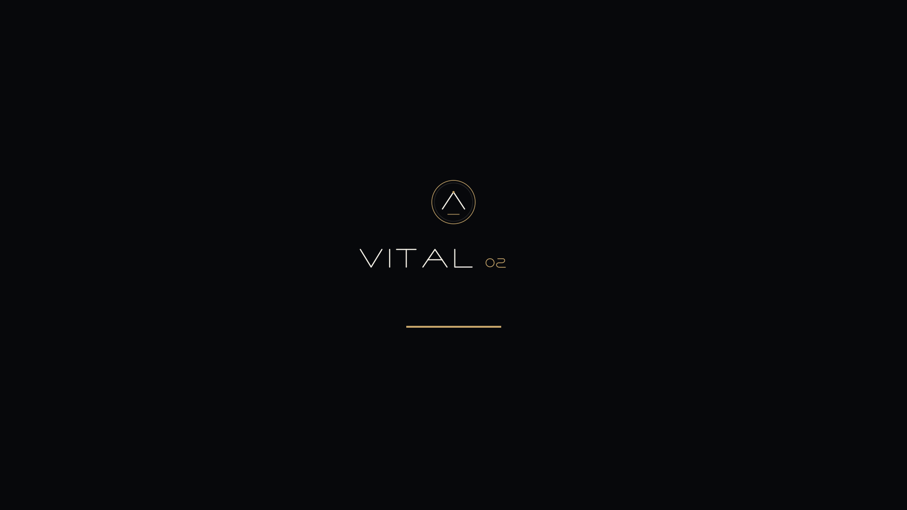

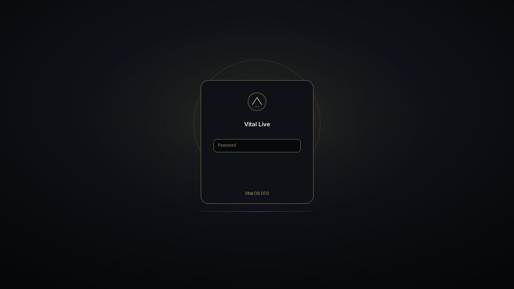

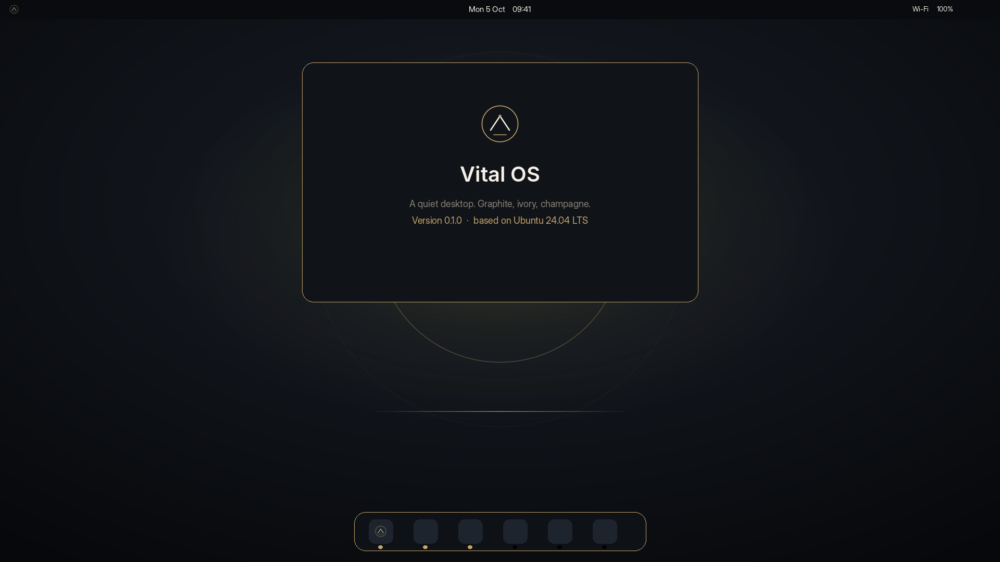

Vital Welcome, exported from the GTK4 app. Pages are a stack, so the next page is not visible beside the current one. The title line is Vital OS 0.1.0. "based on Ubuntu 24.04 LTS" is the line under it.

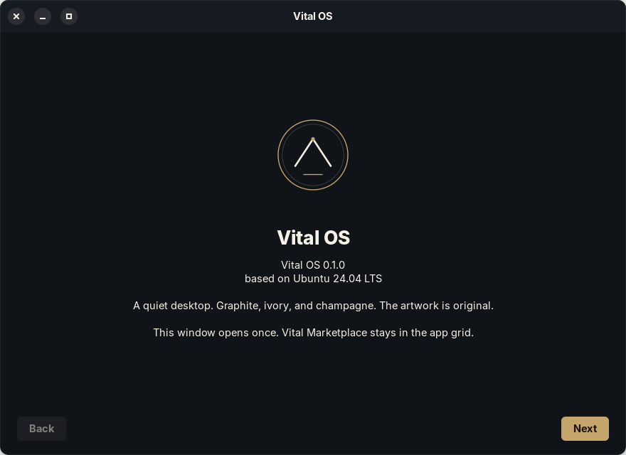

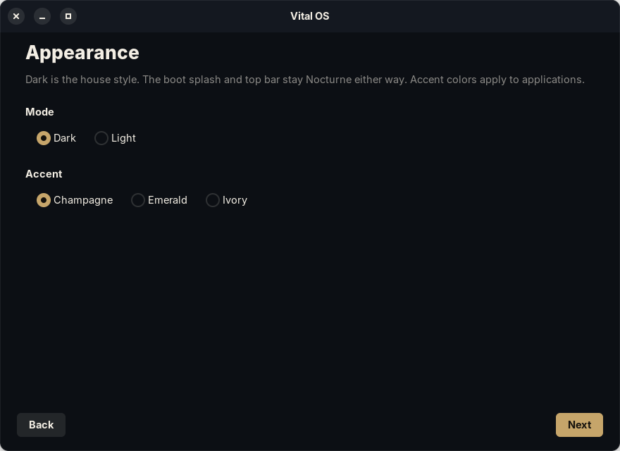

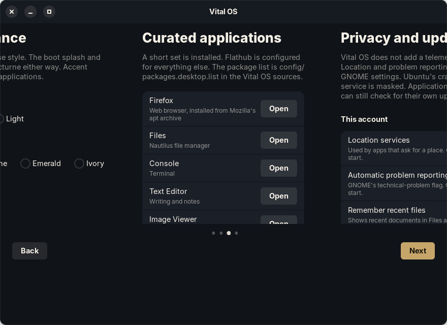

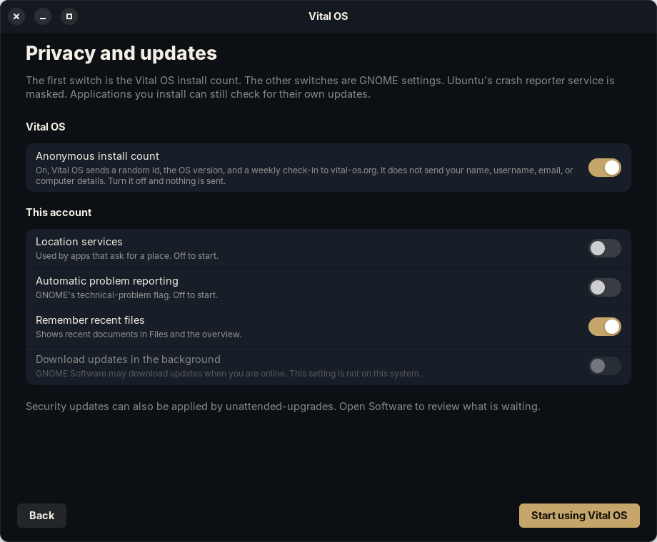

Vital Marketplace, exported from the GTK4 app against the bundled catalog:

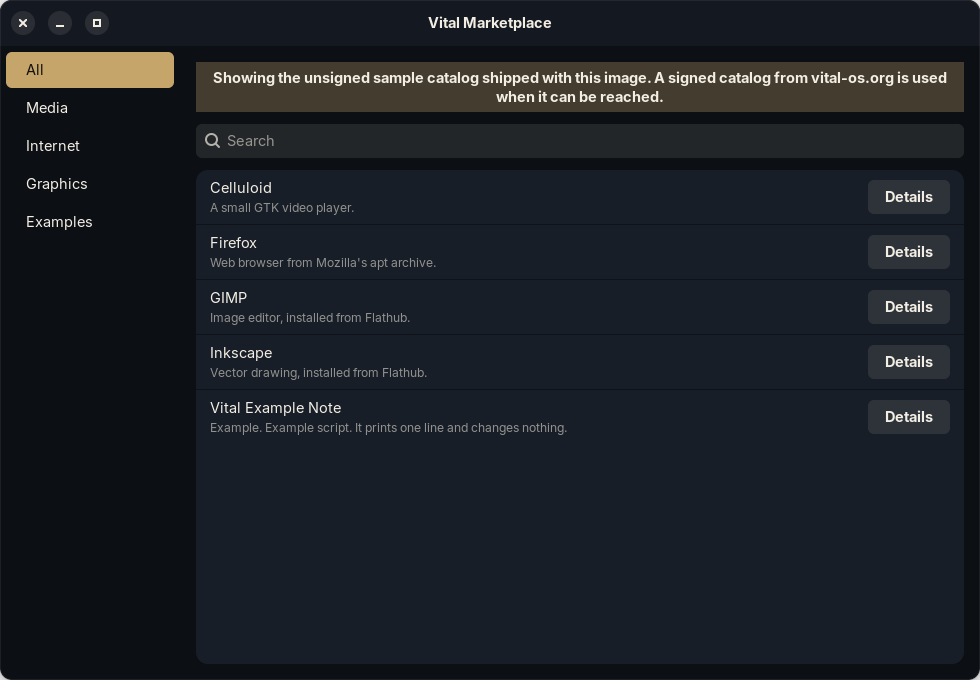

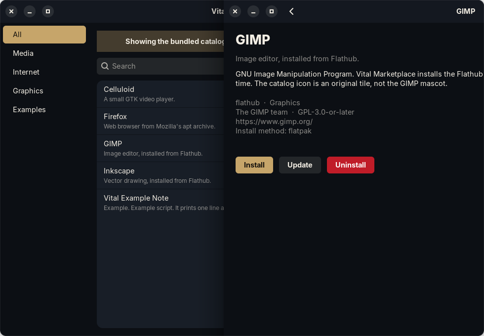

The catalog admin UI at `/mgmt`, from a local server session. The counts are from that session, not a public deployment:

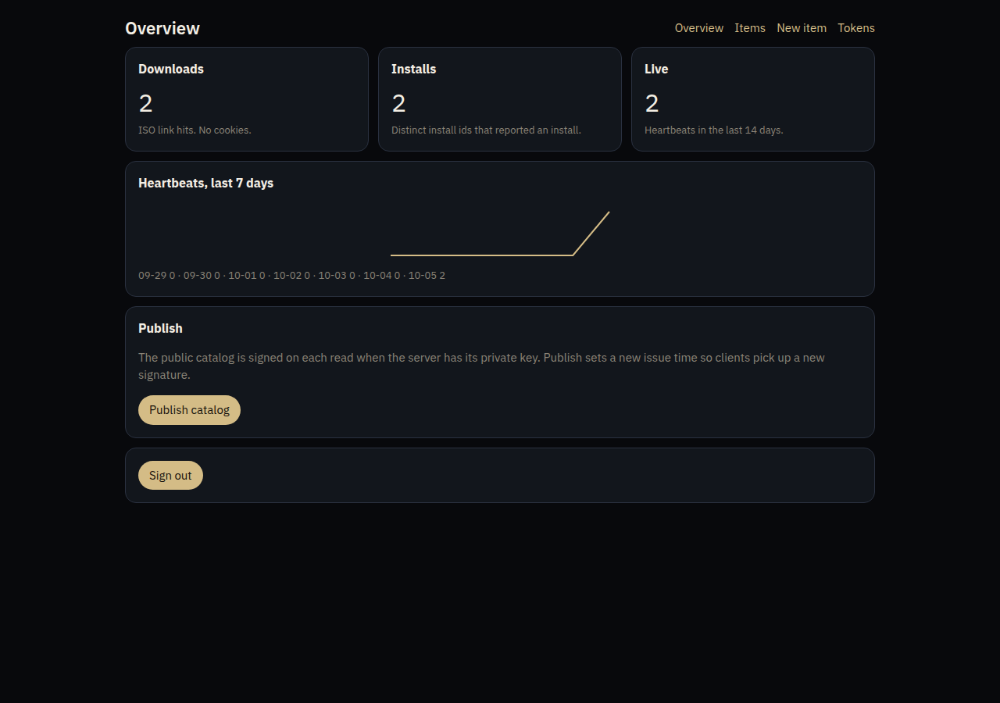

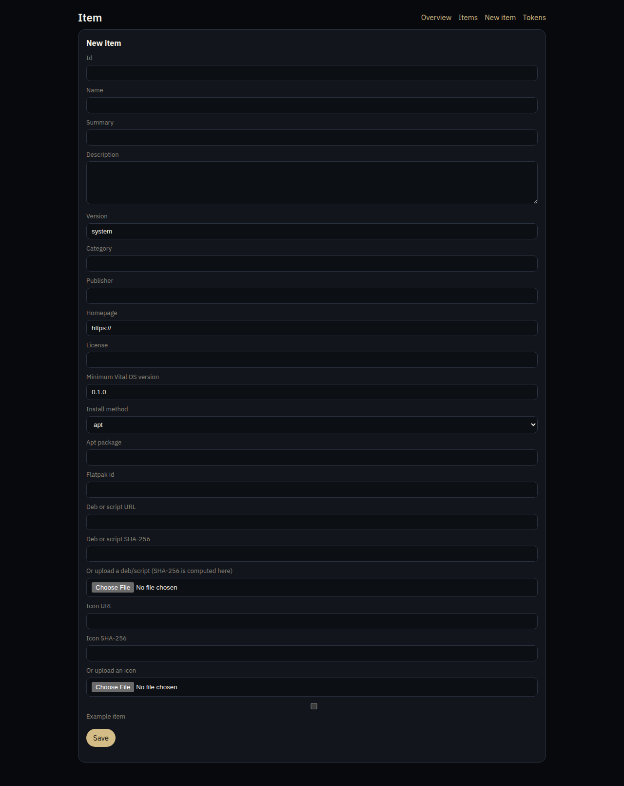

Day wallpaper:

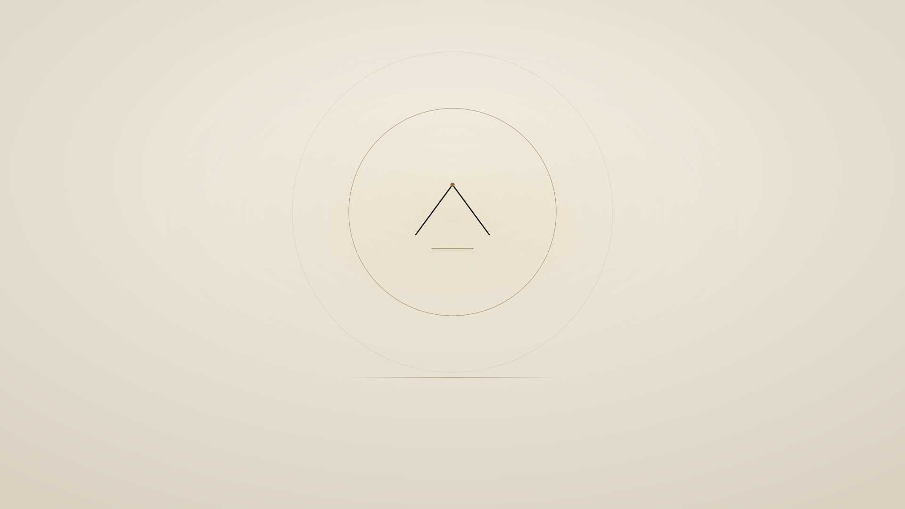

Real frames from QEMU (TCG, because KVM was not usable on the build host). BIOS and UEFI both reached the GRUB theme. The splash and the text console are from the live initrd:

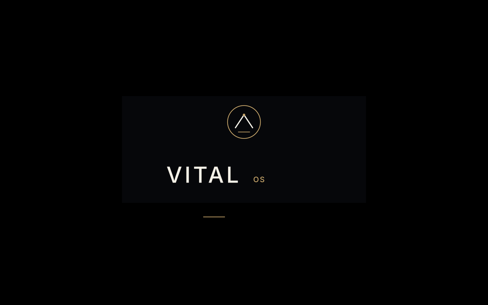


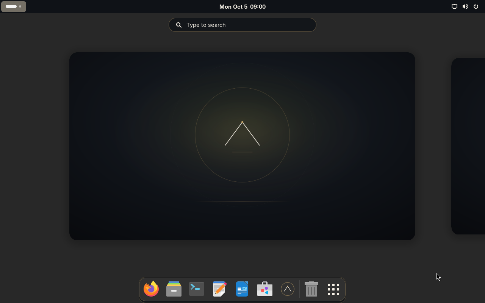

The rebuilt ISO, booted with `noplymouth` and a virtio GPU, reached this GDM greeter. The frame is from the guest:


## Verification

On an Ubuntu 24.04 host:

- `./build.sh check` passes: `bash -n`, `python3 -m py_compile`, and shellcheck.
- `docs/screenshots/wallpaper.png`, `plymouth.png`, `gdm.png`, and `desktop.png` are composed from the SVG branding.
- Vital Welcome was launched with GTK 4 and libadwaita. The four `welcome*.png` files are exports of those pages.
- `sudo ./build.sh iso` completed. The image is `build/output/VitalOS-0.1.0-amd64.iso`, about 1.8 GiB, so it does not need to be split for a GitHub release. It is gitignored.
- QEMU with KVM exited with "Permission denied" for this user. Running it as root hit a host KVM fault, so the boot tests used TCG.
- BIOS and UEFI (OVMF pflash) both showed the Vital OS GRUB menu: Try, Install, and safe graphics. See `docs/screenshots/qemu-grub-bios.png` and `docs/screenshots/qemu-uefi.png`.
- A direct kernel boot of that ISO, with the same `boot=casper quiet` arguments as the GRUB entry, passed the overlay mount, started GNOME Display Manager, and started the live user session (`user@1000`). The framebuffer stayed on the Plymouth splash (`docs/screenshots/qemu-plymouth.png`) for the few minutes TCG was left running, so there is no photograph of the GNOME desktop from the guest. tty2 showed `Vital OS 0.1.0 vitalos` and a login prompt (`docs/screenshots/qemu-console.png`).
- Calamares was not clicked through an install. Plymouth logged a missing `label-pango.so` plugin; the logo is a pixmap and still appeared. The ISO tree now also contains `/EFI/BOOT/BOOTX64.EFI` in addition to the appended FAT image. Secure Boot was not tested and is not supported.
- Welcome no longer uses a carousel. GTK exports of the four pages show one page at a time, and the product line is `Vital OS 0.1.0` with `based on Ubuntu 24.04 LTS` underneath, including when `/etc/os-release` on the machine running the app is Ubuntu.
- Marketplace unit tests cover authentication (401 without a token), schema rejection (422), ed25519 catalog signatures, ETag 304 responses, and the admin rate limit. They also cover the `/mgmt` cookie session (CSRF required, bearer still required on `/api`), telemetry field rejection, and the cookieless ISO download counter. The example script helper refuses to run without confirmation and accepts a dry run when the SHA-256 matches.
- `sudo ./build.sh iso` was run again after these changes. It finished, and `build/output/VitalOS-0.1.0-amd64.iso` now contains `PRETTY_NAME="Vital OS 0.1.0"`, `vital-marketplace`, the bundled catalog, and `/EFI/BOOT/BOOTX64.EFI`. The image is gitignored.
- That rebuilt ISO was booted in QEMU with TCG, `noplymouth`, and `-vga virtio`. It reached GDM. `docs/screenshots/qemu-gdm-live.png` is that guest greeter. Automatic login started `user@1000` on an earlier boot of the previous ISO and the framebuffer then stayed on a black spinner, so there is still no photograph of the GNOME desktop. KVM was not usable. Calamares was not clicked through an install.

## Trademarks and licenses

Vital OS is an unofficial derivative. Ubuntu is a trademark of Canonical Ltd. The original mark, wallpapers, themes, and Vital Welcome in this repository are GPL-3.0-or-later. Third-party pieces keep their own licenses; see `overlay/usr/share/vitalos/NOTICE` and `config/sources.env`.
